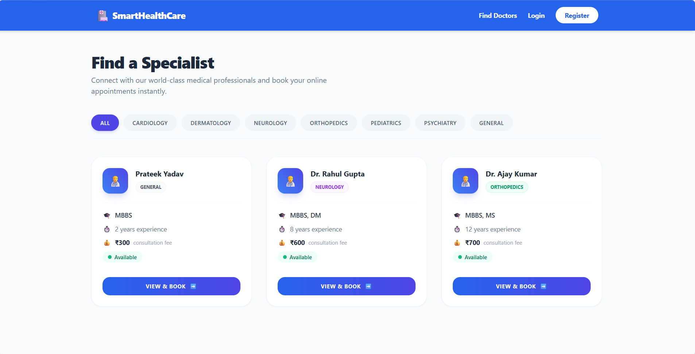
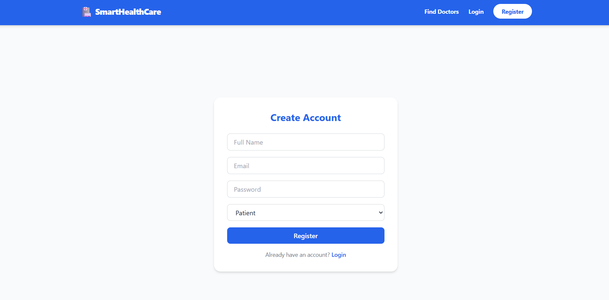
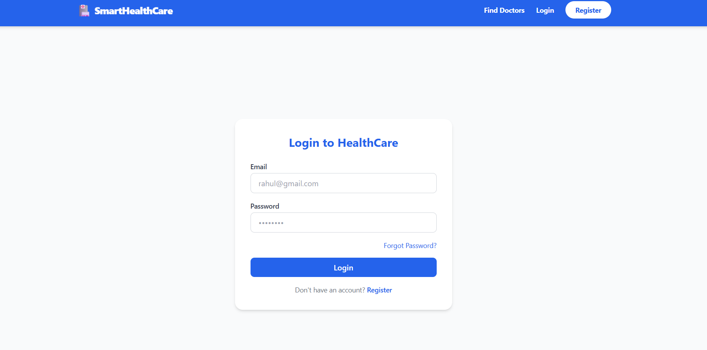
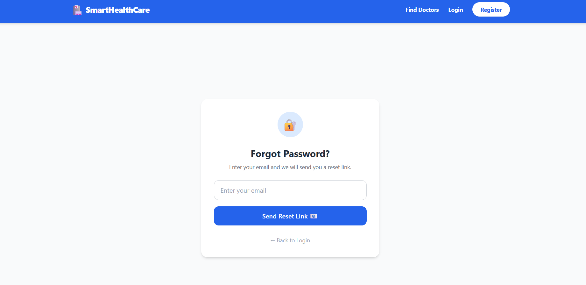
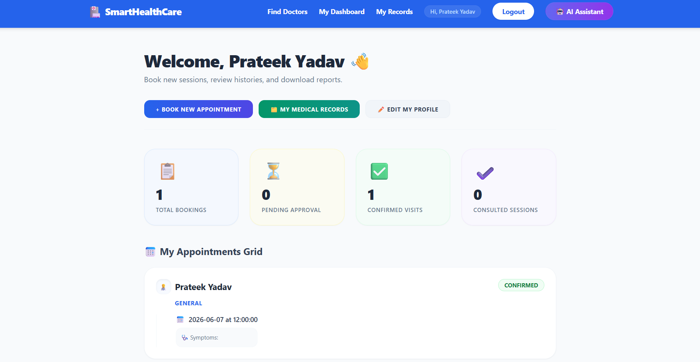
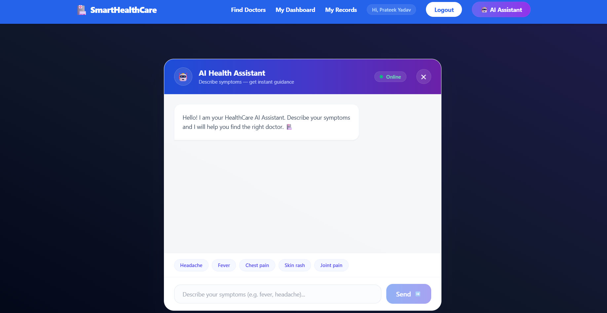
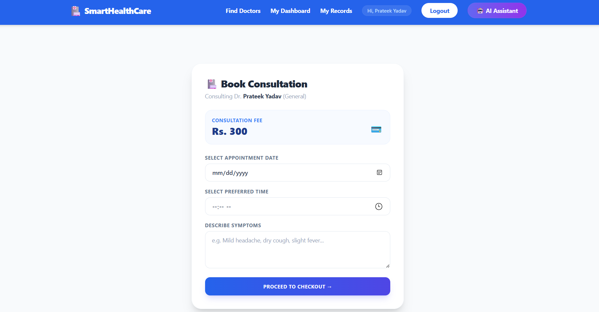

# 🏥 SmartHealthCare: AI-Powered Clinical Console & Secure Transactional Ledger

[](https://smart-health-care-system-u3bv.vercel.app/doctors)
[](https://spring.io/projects/spring-boot)
[](https://react.dev/)

<p align="center">
  
</p>

SmartHealthCare is a state-of-the-art, enterprise-grade digital healthcare console and medical records management portal. It integrates an intelligent symptom triage chatbot engine, secure role-based dashboard metrics, a highly-robust ACID-compliant **Payment Transaction Ledger** mapping simulated checkouts, and independent containerized container orchestration using Docker.

Designed with modern full-stack architecture standards, this project is optimized for production scalability, high performance, and robust security, making it a stellar showcase for advanced product engineering standards.

---

## 🚀 Key Architectural Capabilities

### 1. ACID-Compliant Transaction Ledger
- Mapped a secure `@OneToOne` relation between `Appointment` and `Payment` database schemas.
- Implemented Spring Framework's `@Transactional` boundary tags on the backend payments endpoint (`/api/payments/process`), securing transaction states. If a ledger commit fails, any related appointment status updates are automatically rolled back, guaranteeing absolute data consistency.
- Automatically generates secure, non-collision Transaction IDs (e.g. `TXN_SHC_XXXXXXXX`) and injects them dynamically onto printed PDF receipts.

### 2. Live Dynamic UPI QR Code Checkout
- Features an interactive payment gateway wizard supporting UPI QR Code scanning and card inputs.
- Automatically constructs a scan-ready live UPI payment URL matching the doctor's name and exact consultation fee:
  `upi://pay?pa=smarthealthcare@okaxis&pn=SmartHealthCare&am={FEES}&cu=INR`
- Generates a **real-time UPI QR Code image** in the React DOM. Scanning this QR code using GPay, PhonePe, or Paytm instantly opens the payment interface with pre-filled amounts on your smartphone!

### 3. AI-Powered Symptom Triage Chatbot
- Integrates an intelligent AI assistant using **Claude 3.5 Sonnet** (`claude-3-5-sonnet-20241022`) via Anthropic APIs.
- Features a robust **Local Fallback Diagnostic Engine** that analyzes patient queries locally using keyword-based triage if the external AI service is unreachable or rate-limited.
- Recommends the correct doctor specialization and provides general health safety tips instantly.

### 4. Interactive Timelines & Searchable Records History
- Upgraded the Doctor Dashboard with an interactive **"Medical Records History"** tabbed console.
- Features a real-time patient name search query filter and automated PDF export buttons, enabling doctors to search through written records history dynamically.

### 5. Complete Mobile Responsiveness
- Implemented global viewport bounds (`overflow-x: hidden`) restricting layouts from shifting or shaking horizontally.
- Refactored the navigation bar to support a collapsible hamburger menu (☰ / ✕) on small screens, which expands into an interactive dropdown drawer with premium vertical clinical card layouts.

### 6. Multi-Stage Docker Containerization
- Built with a professional, **two-stage build Dockerfile** compilation pattern to ensure highly secure, lightweight production image wrappers.
- Orchestrates Spring Boot and MySQL databases under isolated overlay networks seamlessly using `docker-compose`.

---

## 🛠️ Technology Stack

- **Backend:** Spring Boot (Java 17), Spring Data JPA, Spring Security (JWT Tokens), Lombok, Swagger UI (Springdoc OpenAPI)
- **Frontend:** React (JSX), Tailwind CSS, Axios Client, PDF Generation utilities (jsPDF)
- **Database & Cache:** MySQL 8.0, Redis In-Memory caching (configured)
- **DevOps:** Docker, Docker Compose, Git Version Control

---

## 🐋 How to Deploy and Run (Local Containerized Environment)

### Prerequisites
Make sure you have [Docker Desktop](https://www.docker.com/products/docker-desktop/) installed and running on your local machine.

### Step 1: Boot Up Backend and Database (Docker Compose)
Open your terminal, navigate to the **`Backend/`** folder of the project, and execute:
```bash
docker-compose up --build
```
* **What happens:** Docker compiles the Spring Boot source files, downloads the MySQL 8.0 image, links them securely, exposes the Backend at `http://localhost:8081` and the database at port `3306` mapped locally.
* **Verify Health:** Open `http://localhost:8081/actuator/health` in your browser. It should return `{"status":"UP"}` indicating a healthy micro-service boot.

### Step 2: Boot Up Frontend (React Local Dev)
Open a new terminal window, navigate to the **`frontend/`** folder, and run:
```bash
# Install dependencies
npm install

# Start development server
npm start
```
* **Verify Client:** React will automatically launch at `http://localhost:3000` and link with the containerized Spring Boot backend services running at port `8081` instantly.

---

## 🔍 REST API Documentation (OpenAPI Swagger UI)
Once the backend container is running, developers can browse, inspect, and test all REST endpoints (authentication, appointments booking, payments ledger, clinical records) dynamically by navigating to:
```url
http://localhost:8081/swagger-ui/index.html
```

---

## 📸 Screenshots

### Dashboard


### Register Page


### Login Page


### Reset Password


### Welcome Page


### Chat Bot


### Book Appointment


---

## 👨‍💻 Author

**Prateek Yadav**  
Java Full Stack Developer  
